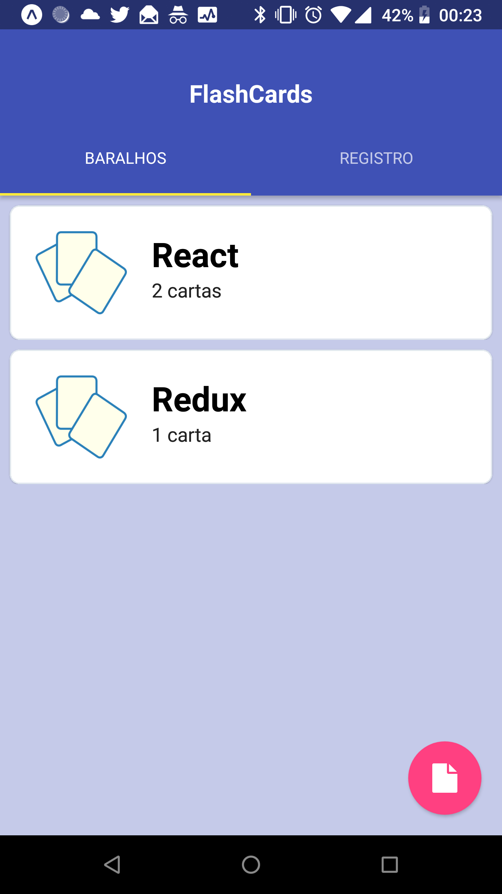
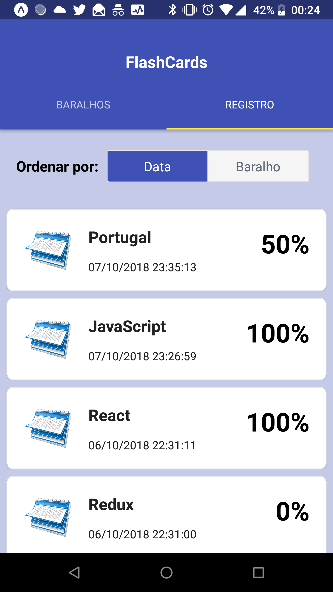
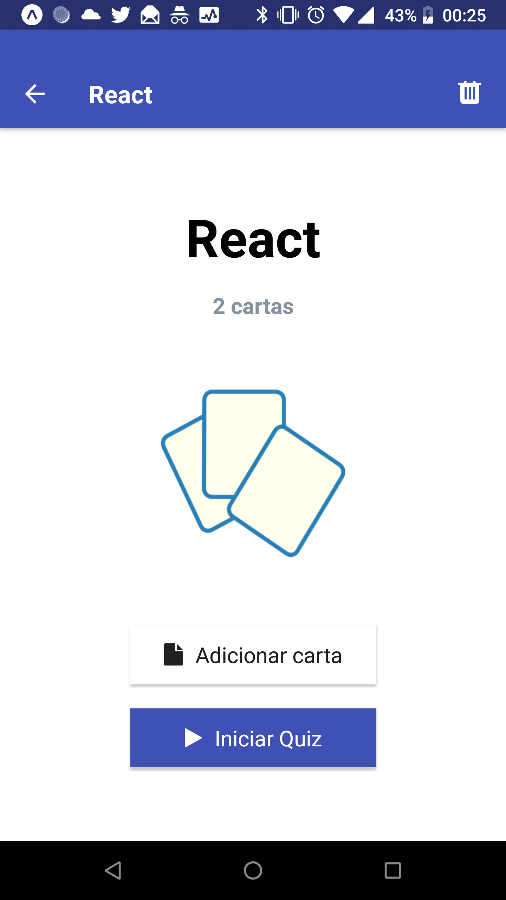

# Udacity React Nanodegree - Projeto 3 (FlashCards)

Neste projeto temos um aplicativo mobile construído em [React Native](https://facebook.github.io/react-native/) com o propósito de permitir que os usuários estudem uma coleção de flashcards. Com o app, os usuários poderão criar diferentes categorias de flashcards chamadas de "baralhos", adicionar flashcards a esses baralhos, e fazer os quizes nestes baralhos. Os usuários também poderão acompanhar a evolução dos seus estudos num registro de quizes realizados e serem lembrados diariamente de realizar ao menos um quiz.

**OBS:** O aplicativo foi testado em dispositivos [Android](https://www.android.com/), mas acredito que deverá funcionar perfeitamente em dispositivos [IOS](https://www.apple.com/ios/), visto que não foi utilizado código nativo da platafoma Android.

**Imagens:**

<table align="center">
  <tr>
     <td>
       
       
Tela inicial com baralhos

     </td>
     <td>
       
       
Registro de estudos

     </td>
  </tr>
  <tr>
     <td>
       
       
Tela do baralho

     </td>
     <td>
       
       
Quiz em execução

     </td>
  </tr>
</table>

## Instalação:

* Faça o download e instale o [Node.js](https://nodejs.org/en/)
* Faça um clone do repositório
* Abra uma janela de terminal, acesse a pasta do projeto e digite os comandos:
    - `npm install -g expo-cli`
    - `npm install`
    - `expo start`
* Instale em seu celular o Expo Cient:
    - [Android](https://play.google.com/store/apps/details?id=host.exp.exponent)
    - [IOS](https://itunes.apple.com/us/app/expo-client/id982107779?mt=8)
* Abra o Expo Client e escaneie o código QR sendo exibido na janela do terminal

## Expo CLI

Este projeto foi gerado com [Expo CLI](https://docs.expo.io/versions/latest/workflow/expo-cli). Mais informações [aqui](https://docs.expo.io/versions/v30.0.0/).

## React Native Elements

A interface do usuário deste projeto foi desenvolvida com o framework [React Native Elements](https://react-native-training.github.io/react-native-elements/).

## Copyright

Esse projeto foi desenvolvido por Márcio Souza de Oliveira e o código do backend local foi disponibilizado pela Udacity.
